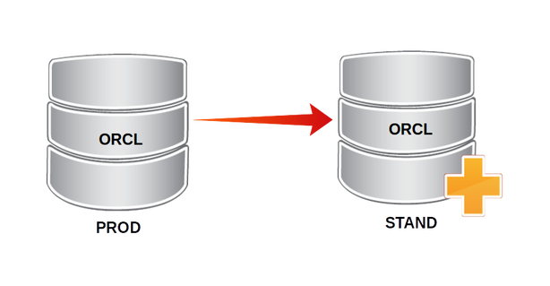

Requirements:

- Install & create orace database version 12.2.0.1 on both servers. Reference at: [https://github.com/keepwalking86/oracle12c](https://raw.githubusercontent.com/keepwalking86/oracle12c/master/setup_oracle12c_cenos7.sh)

- Oracle instance: **orcl**

- Listener net on servers: PRODB, STANDB

```
ORACLE_BASE=/u01/app/oracle
ORACLE_HOME=/u01/app/oracle/product/12.2.0.1/db_1
```

- Địa chỉ IP: server01:192.168.10.101 và server02:192.168.10.102

<p align="center">

</p>

**Steps to move/clone a database using RMAN**

**Step1**: Establish connectivity between the target and destination server (tnsnames.ora, sqlnet.ora)

- Edit hostname

```
echo "192.168.10.101 server01" >>/etc/hosts
echo "192.168.10.102 server02" >>/etc/hosts
```

- Configure listener net

To establish connect to oracle database on server01, we need create listener net **PRODB** on both servers.

Default path of tnsnames.ora at **$ORACLE_HOME/network/admin**

Edit tnsnames.ora of listener as following:

```
LISTENER_ORCL =
  (ADDRESS = (PROTOCOL = TCP)(HOST = server01)(PORT = 1521))
PRODB =
  (DESCRIPTION =
    (ADDRESS = (PROTOCOL = TCP)(HOST = server01)(PORT = 1521))
    (CONNECT_DATA =
      (SERVER = DEDICATED)
      (SERVICE_NAME = orcl)
    )
)
STANDB =
  (DESCRIPTION =
    (ADDRESS = (PROTOCOL = TCP)(HOST = server02)(PORT = 1521))
    (CONNECT_DATA =
      (SERVER = DEDICATED)
      (SERVICE_NAME = orcl)
    )
)
```

- We apply new changes made to listener configuration by using lsnrctl

`lsnrctl reload`

- Using tnsping to make sure we can connect to instances

```
tnsping PRODB
tnsping STANDB
```
>
TNS Ping Utility for Linux: Version 12.2.0.1.0 - Production on 22-JUN-2018 09:36:45
Copyright (c) 1997, 2016, Oracle.  All rights reserved.
Used parameter files:
/u01/app/oracle/product/12.2.0.1/db_1/network/admin/sqlnet.ora
Used TNSNAMES adapter to resolve the alias
Attempting to contact (DESCRIPTION = (ADDRESS = (PROTOCOL = TCP)(HOST = STANDB)(PORT = 1521)) (CONNECT_DATA = (SERVER = DEDICATED) (SERVICE_NAME = orcl)))

**Step2**: Create a parameter file on server02

We can export pfile from server01, then copy pfile to server02 and edit custom compatibility. Or, we can create pfile on server02 with statements: DB_NAME, CONTROL_FILES, DB_BLOCK_SIZE, COMPATIBLE, SGA_TARGET

Creating pfile for server02 as following:

- creat pfile from spfile

`sql>create pfile='/tmp/pfile.ora' from spfile;`

- Editing pfile

Informations customize about database, path, ..  Modify it to what we need

```
orcl.__data_transfer_cache_size=0
orcl.__db_cache_size=1207959552
orcl.__inmemory_ext_roarea=0
orcl.__inmemory_ext_rwarea=0
orcl.__java_pool_size=16777216
orcl.__large_pool_size=33554432
orcl.__oracle_base='/u01/app/oracle'#ORACLE_BASE set from environment
orcl.__pga_aggregate_target=436207616
orcl.__sga_target=1728053248
orcl.__shared_io_pool_size=83886080
orcl.__shared_pool_size=369098752
orcl.__streams_pool_size=0
*.audit_file_dest='/u01/app/oracle/admin/orcl/adump'
*.audit_trail='db'
*.compatible='12.2.0'
*.control_files='/u01/app/oracle/oradata/orcl/control01.ctl','/u01/flash_recovery_area/orcl/control02.ctl'#Restore Controlfile
*.db_block_size=8192
*.db_name='ORCL'#Reset to original value by RMAN
*.db_recovery_file_dest='/u01/flash_recovery_area'
*.db_recovery_file_dest_size=10398m
*.diagnostic_dest='/u01/app/oracle'
*.dispatchers='(PROTOCOL=TCP) (SERVICE=orclXDB)'
*.local_listener='LISTENER_ORCL'
*.nls_language='AMERICAN'
*.nls_territory='AMERICA'
*.open_cursors=300
*.pga_aggregate_target=410m
*.processes=300
*.remote_login_passwordfile='EXCLUSIVE'
*.sga_target=1638m
*.undo_tablespace='UNDOTBS1'
```

- create spfile from pfile

```
sql>shutdown immediate
sql>create spfile from pfile='/tmp/pfile.ora';
```

**Step3**: Create the directories for the database files

If on server02 created and configured oracle database then don't need execute this step

```
cd $ORACLE_BASE/admin/
mkdir orcl
cd orcl/
mkdir adump bdump cdump udump
cd ..
mkdir flash_recovery_area
```

**Step4**: Create controlfile on server02

To controlfile on server02 includes informations as Logfile, datafile, .. same server01, then recreate controlfile as following:

**On server01**

- Export controlfile

`SQL> alter database backup controlfile to trace as '/home/oracle/controlfile.sql';`

- Copy controlfile.sql to server02

`scp /home/oracle/controlfile.sql oracle@server02:/home/oracle`

On server02:

- Delete ControlFile files

- Modify controlfile.sql to what we need

```
STARTUP NOMOUNT
CREATE CONTROLFILE SET DATABASE "ORCL" RESETLOGS
 MAXLOGFILES 16
 MAXLOGMEMBERS 3
 MAXDATAFILES 100
 MAXINSTANCES 8
 MAXLOGHISTORY 292
LOGFILE
 GROUP 1 '/u01/app/oracle/oradata/orcl/redo01.log' SIZE 200M BLOCKSIZE 512,
 GROUP 2 '/u01/app/oracle/oradata/orcl/redo02.log' SIZE 200M BLOCKSIZE 512,
 GROUP 3 '/u01/app/oracle/oradata/orcl/redo03.log' SIZE 200M BLOCKSIZE 512
DATAFILE
 '/u01/app/oracle/oradata/orcl/system01.dbf',
 '/u01/app/oracle/oradata/orcl/smsgw01.dbf',
 '/u01/app/oracle/oradata/orcl/sysaux01.dbf',
 '/u01/app/oracle/oradata/orcl/undotbs01.dbf',
 '/u01/app/oracle/oradata/orcl/vascms01.dbf',
 '/u01/app/oracle/oradata/orcl/users01.dbf',
 '/u01/app/oracle/oradata/orcl/service01.dbf'
CHARACTER SET AL32UTF8;
```

- Recreate ControlFile from controlfile.sql

```
sqlplus / as sqlplus
SQL>shutdown immediate
SQL> @/home/oracle/controlfile.sql
Control file created.
SQL> alter database open resetlogs;
Database altered.
SQL>
```

**Step5**: Backup database on server01 and copy to server02

- Using RMAN backup full database on server01

```
$rman target /
RMAN>BACKUP AS COMPRESSED BACKUPSET DATABASE PLUS ARCHIVELOG;
```
- Copy backup to server02

`scp -r /u01/oracle/backupset oracle@server02:/u01/oracle/`

Using `show all` command to know backup location

```
RMAN>show all;

CONFIGURE CONTROLFILE AUTOBACKUP FORMAT FOR DEVICE TYPE DISK TO '/u01/oracle/backupset/%F';
```

**Step6**: Run RMAN to duplicate database on server02

- Startup the destination database in nomount

```
$sqlplus / as sysdba
sql>shutdown immediate
sql>startup nomount
```

- Duplicate the Database

```
[oracle@server02 ~]$ rman
RMAN> connect auxiliary /
connected to auxiliary database: ORCL (not mounted)
RMAN> connect target sys/Oracle12c@PRODB
connected to target database: ORCL (DBID=1479180811)
RMAN>run
{
allocate auxiliary channel c1 device type disk;
allocate channel c2 device type disk;
duplicate target database to orcl nofilenamecheck;
}
```

==> Duplication process:

>>>
```
using target database control file instead of recovery catalog
allocated channel: c1
channel c1: SID=36 device type=DISK

allocated channel: c2
channel c2: SID=134 device type=DISK

Starting Duplicate Db at 22-JUN-18
current log archived

contents of Memory Script:
{
   sql clone "alter system set  db_name = 
 ''ORCL'' comment=
 ''Modified by RMAN duplicate'' scope=spfile";
   sql clone "alter system set  db_unique_name = 
 ''orcl'' comment=
 ''Modified by RMAN duplicate'' scope=spfile";
   shutdown clone immediate;
   startup clone force nomount
   restore clone primary controlfile;
   alter clone database mount;
}
executing Memory Script

sql statement: alter system set  db_name =  ''ORCL'' comment= ''Modified by RMAN duplicate'' scope=spfile

sql statement: alter system set  db_unique_name =  ''orcl'' comment= ''Modified by RMAN duplicate'' scope=spfile

Oracle instance shut down

Oracle instance started

Total System Global Area    1728053248 bytes

Fixed Size                     8621568 bytes
Variable Size                536871424 bytes
Database Buffers            1174405120 bytes
Redo Buffers                   8155136 bytes
allocated channel: c1
channel c1: SID=34 device type=DISK

Starting restore at 22-JUN-18

channel c1: starting datafile backup set restore
channel c1: restoring control file
channel c1: reading from backup piece /u01/oracle/backupset/c-1479180811-20180620-00
channel c1: piece handle=/u01/oracle/backupset/c-1479180811-20180620-00 tag=TAG20180620T140919
channel c1: restored backup piece 1
channel c1: restore complete, elapsed time: 00:00:01
output file name=/u01/app/oracle/oradata/orcl/control01.ctl
output file name=/u01/flash_recovery_area/orcl/control02.ctl
Finished restore at 22-JUN-18

database mounted
```
